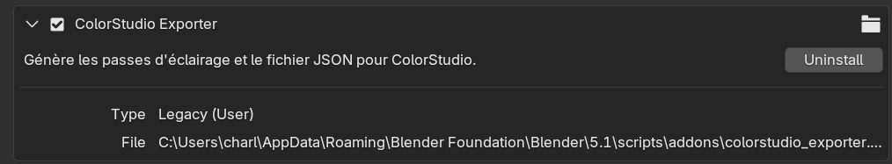
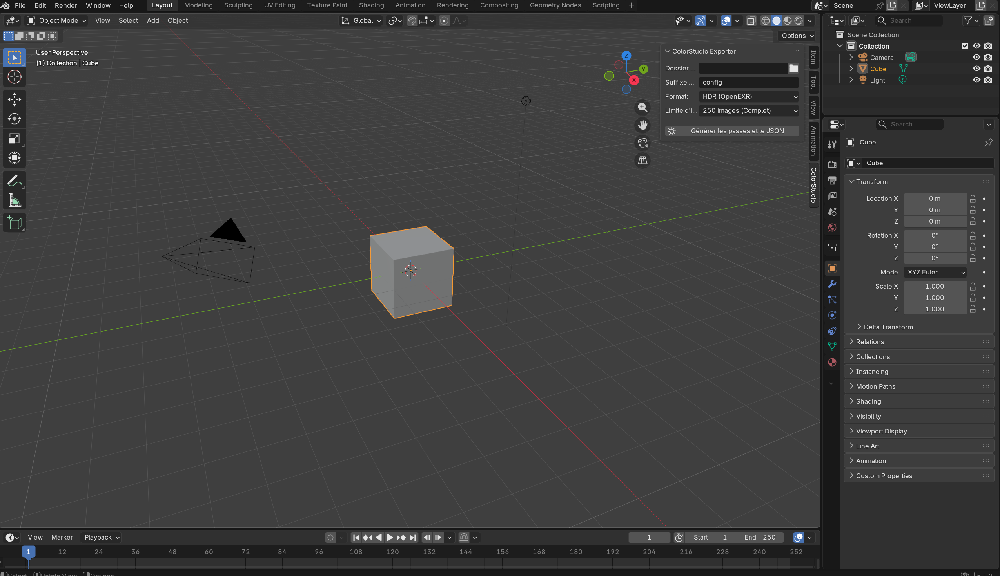
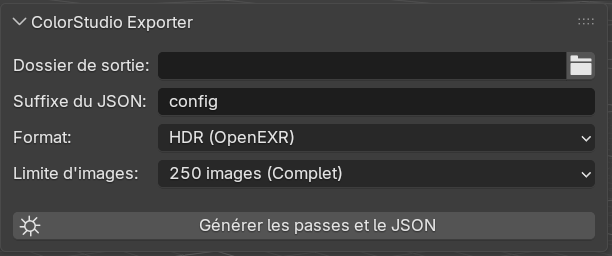

# Intégration Blender : Plugin ColorStudio Exporter

Le plugin **ColorStudio Exporter** est un Add-on Blender conçu spécifiquement pour le projet ColorStudio. Il permet d'automatiser entièrement le processus de rendu par passe (une lumière à la fois) et de générer automatiquement le fichier de configuration `.json` compatible avec l'application.

Le plugin prend en charge **le format HDR** et **le format PNG**.

---

## 1. Installation du Plugin

L'installation du plugin se fait de manière standard via les préférences de Blender.

1. Téléchargez ou copiez le script Python du plugin et sauvegardez-le sous le nom `colorstudio_exporter.py`.
2. Ouvrez Blender.
3. Allez dans le menu **Edit** > **Preferences**.
4. Dans le menu de gauche, sélectionnez l'onglet **Add-ons**.
5. Cliquez sur le bouton **Install...** en haut à droite.
6. Naviguez jusqu'à votre fichier `colorstudio_exporter.py` et sélectionnez-le.
7. Une fois installé, **cochez la case** à côté de *Render: ColorStudio Exporter* pour l'activer.

!!! tip "Sauvegarde des préférences"
    Si vous souhaitez que le plugin soit actif à chaque ouverture de Blender, assurez-vous que l'option *Auto-Save Preferences* est activée en bas à gauche de la fenêtre des préférences.

---

## 2. Accès à l'interface (UI)

Une fois le plugin activé, son interface est intégrée directement dans l'espace de travail principal pour une meilleure ergonomie.

1. Placez votre curseur dans la **Vue 3D** (3D Viewport) de Blender.
2. Appuyez sur la touche <kbd>N</kbd> de votre clavier pour ouvrir le menu latéral droit (N-Panel).
3. Cliquez sur le nouvel onglet nommé **ColorStudio**.

---

## 3. Paramétrage et Utilisation

Le panneau propose plusieurs réglages permettant de s'adapter aux différentes phases du projet (test rapide ou rendu final).

### Les paramètres

* **Dossier de sortie** : Permet de choisir le dossier racine où seront exportées les données. Le script créera automatiquement un sous-dossier portant le nom de la scène actuelle.
* **Suffixe du JSON** : Permet de nommer le fichier de configuration généré. Le nom final sera au format `[NomDeLaScene]_[Suffixe].json`. (Par défaut : *config*).
* **Format** : 
    * `HDR (OpenEXR)` : Exporte les images en 32-bit. C'est le format requis pour le rendu final et pour valider la gestion du HDR dans ColorStudio.
    * `LDR (JPEG)` : Exporte les images en 8-bit. Idéal pour faire des tests rapides avec un poids de fichier minimal.
* **Limite d'images** : Permet de réduire le nombre d'images calculées sur la trajectoire (de 50 à 250 images). Très utile pour valider un éclairage sans attendre le rendu complet de l'animation.
  

### Lancer la génération

Une fois vos réglages effectués, cliquez sur le bouton **Générer les passes et le JSON** (marqué par une icône de soleil).

!!! warning "Attention aux temps de calcul"
    Blender va figer pendant la génération. Le temps de traitement dépendra de la complexité de votre scène, du moteur de rendu utilisé (Eevee ou Cycles) et de la limite d'images sélectionnée.

---

## 4. Fonctionnement technique 

Lorsque l'opérateur est lancé, le script effectue les actions suivantes en arrière-plan :

1. **Isolation des lumières :** Le script identifie toutes les sources lumineuses de type `LIGHT` dans la scène. Il boucle sur chacune d'entre elles, l'allume, et éteint temporairement toutes les autres.
2. **Parcours de la trajectoire :** Pour la lumière active, le script fait défiler la timeline de Blender (en respectant la limite d'images définie).
3. **Rendu :** À chaque frame, une image est rendue et sauvegardée avec la nomenclature stricte attendue par ColorStudio : `[NomDeLaLumiere]_[Index].exr` (ou `.jpg`).
4. **Génération du JSON :** Le script récupère dynamiquement les informations de la scène (nom de la lampe, couleur RVB exacte dans Blender, chemin absolu des dossiers générés, statut HDR) et construit un fichier de configuration `.json` structuré.

### Compatibilité avec ColorStudio

Le fichier JSON généré est directement prêt à être ouvert dans l'interface PyQt6 de ColorStudio. Les chemins d'accès (paths) sont formatés de manière absolue en utilisant des slashs standards `/` pour garantir une compatibilité totale entre les environnements Windows, macOS et Linux de l'équipe de développement.